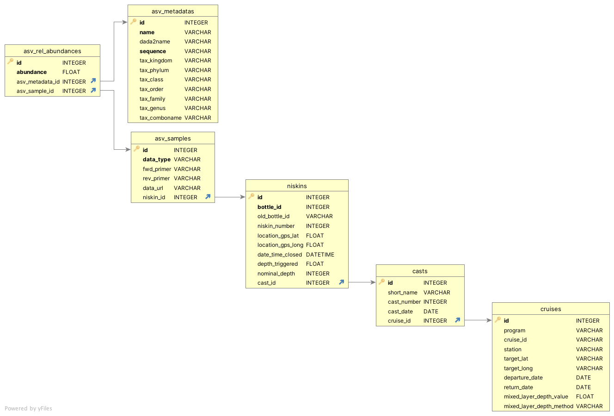

# SargassoDB

## updated 13 March 2026 (Krista)
This is deprecated, use bioscope-portal instead.

This is the private data repository for the BIOS-SCOPE team.

It is built upon an SQLite database with the following entity relationships:

It also provides [FastAPI](https://fastapi.tiangolo.com/tutorial/) access to the database.
