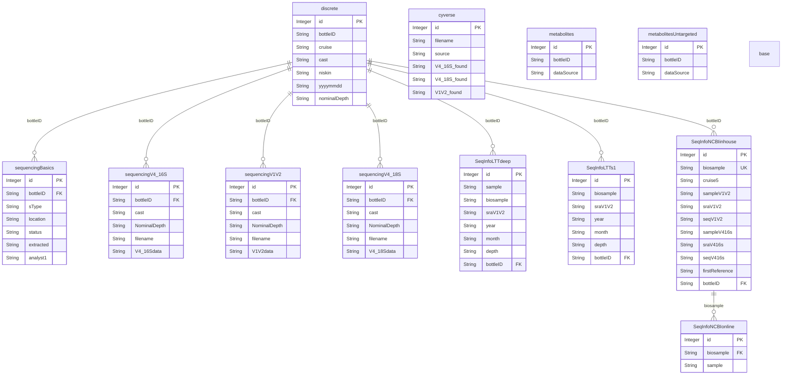

```mermaid 

erDiagram
    discrete {
        Integer id PK
        String bottleID
        String cruise
        String cast
        String niskin
        String yyyymmdd
        String nominalDepth
    }
    cyverse {
        Integer id PK
        String filename
        String source
        String V4_16S_found
        String V4_18S_found
        String V1V2_found
    }
    metabolites {
        Integer id PK
        String bottleID
        String dataSource
    }
    metabolitesUntargeted {
        Integer id PK
        String bottleID
        String dataSource
    }
    sequencingBasics {
        Integer id PK
        String bottleID FK
        String sType
        String location
        String status
        String extracted
        String analyst1
    }
    sequencingV4_16S {
        Integer id PK
        String bottleID FK
        String cast
        String NominalDepth
        String filename
        String V4_16Sdata
    }
    sequencingV1V2 {
        Integer id PK
        String bottleID FK
        String cast
        String NominalDepth
        String filename
        String V1V2data
    }
    sequencingV4_18S {
        Integer id PK
        String bottleID FK
        String cast
        String NominalDepth
        String filename
        String V4_18Sdata
    }
    SeqInfoLTTdeep {
        Integer id PK
        String sample
        String biosample
        String sraV1V2
        String year
        String month
        String depth
        String bottleID FK
    }
    SeqInfoLTTs1 {
        Integer id PK
        String biosample
        String sraV1V2
        String year
        String month
        String depth
        String bottleID FK
    }
    SeqInfoNCBIinhouse {
        Integer id PK
        String biosample UK
        String cruise5
        String sampleV1V2
        String sraV1V2
        String seqV1V2
        String sampleV416s
        String sraV416s
        String seqV416s
        String firstReference
        String bottleID FK
    }
    SeqInfoNCBIonline {
        Integer id PK
        String biosample FK
        String sample
    }
    base {
    }
    discrete ||--o{ sequencingBasics : "bottleID"
    discrete ||--o{ sequencingV4_16S : "bottleID"
    discrete ||--o{ sequencingV1V2 : "bottleID"
    discrete ||--o{ sequencingV4_18S : "bottleID"
    discrete ||--o{ SeqInfoNCBIinhouse : "bottleID"
    SeqInfoNCBIinhouse ||--o{ SeqInfoNCBIonline : "biosample"
    discrete ||--o{ SeqInfoLTTs1 : "bottleID"
    discrete ||--o{ SeqInfoLTTdeep : "bottleID"


```
