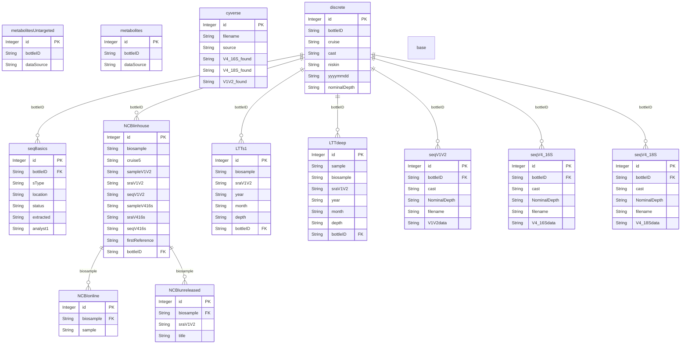

```mermaid 

erDiagram
    seqBasics {
        Integer id PK
        String bottleID FK
        String sType
        String location
        String status
        String extracted
        String analyst1
    }
    metabolitesUntargeted {
        Integer id PK
        String bottleID
        String dataSource
    }
    metabolites {
        Integer id PK
        String bottleID
        String dataSource
    }
    cyverse {
        Integer id PK
        String filename
        String source
        String V4_16S_found
        String V4_18S_found
        String V1V2_found
    }
    discrete {
        Integer id PK
        String bottleID
        String cruise
        String cast
        String niskin
        String yyyymmdd
        String nominalDepth
    }
    base {
    }
    NCBIinhouse {
        Integer id PK
        String biosample
        String cruise5
        String sampleV1V2
        String sraV1V2
        String seqV1V2
        String sampleV416s
        String sraV416s
        String seqV416s
        String firstReference
        String bottleID FK
    }
    NCBIonline {
        Integer id PK
        String biosample FK
        String sample
    }
    NCBIunreleased {
        Integer id PK
        String biosample FK
        String sraV1V2
        String title
    }
    LTTs1 {
        Integer id PK
        String biosample
        String sraV1V2
        String year
        String month
        String depth
        String bottleID FK
    }
    LTTdeep {
        Integer id PK
        String sample
        String biosample
        String sraV1V2
        String year
        String month
        String depth
        String bottleID FK
    }
    seqV1V2 {
        Integer id PK
        String bottleID FK
        String cast
        String NominalDepth
        String filename
        String V1V2data
    }
    seqV4_16S {
        Integer id PK
        String bottleID FK
        String cast
        String NominalDepth
        String filename
        String V4_16Sdata
    }
    seqV4_18S {
        Integer id PK
        String bottleID FK
        String cast
        String NominalDepth
        String filename
        String V4_18Sdata
    }
    discrete ||--o{ seqBasics : "bottleID"
    discrete ||--o{ seqV4_16S : "bottleID"
    discrete ||--o{ seqV1V2 : "bottleID"
    discrete ||--o{ seqV4_18S : "bottleID"
    discrete ||--o{ NCBIinhouse : "bottleID"
    NCBIinhouse ||--o{ NCBIonline : "biosample"
    discrete ||--o{ LTTs1 : "bottleID"
    discrete ||--o{ LTTdeep : "bottleID"
    NCBIinhouse ||--o{ NCBIunreleased : "biosample"


```
