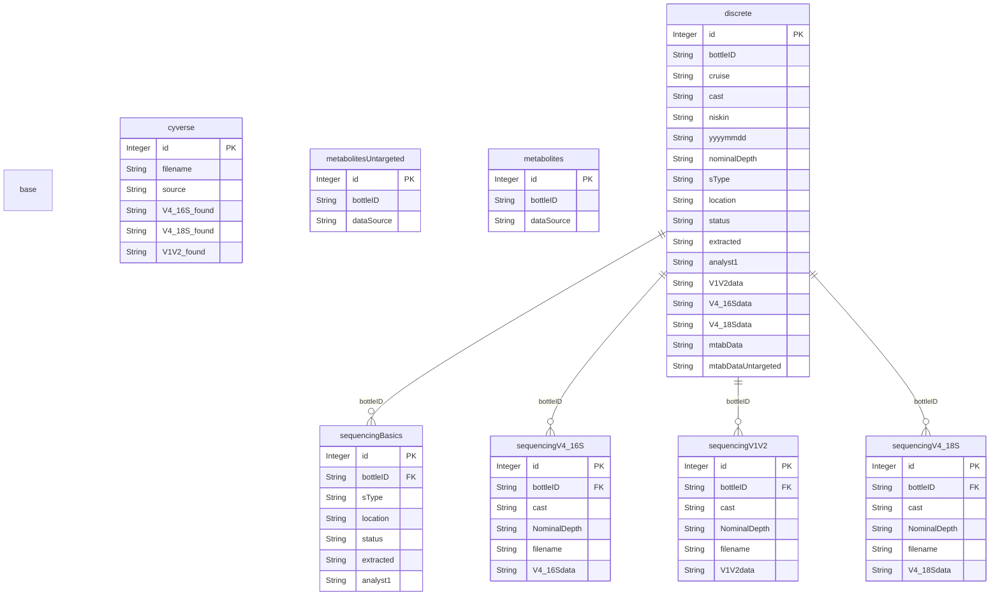

```mermaid 

erDiagram
    sequencingBasics {
        Integer id PK
        String bottleID FK
        String sType
        String location
        String status
        String extracted
        String analyst1
    }
    sequencingV4_16S {
        Integer id PK
        String bottleID FK
        String cast
        String NominalDepth
        String filename
        String V4_16Sdata
    }
    sequencingV1V2 {
        Integer id PK
        String bottleID FK
        String cast
        String NominalDepth
        String filename
        String V1V2data
    }
    sequencingV4_18S {
        Integer id PK
        String bottleID FK
        String cast
        String NominalDepth
        String filename
        String V4_18Sdata
    }
    base {
    }
    cyverse {
        Integer id PK
        String filename
        String source
        String V4_16S_found
        String V4_18S_found
        String V1V2_found
    }
    metabolitesUntargeted {
        Integer id PK
        String bottleID
        String dataSource
    }
    metabolites {
        Integer id PK
        String bottleID
        String dataSource
    }
    discrete {
        Integer id PK
        String bottleID
        String cruise
        String cast
        String niskin
        String yyyymmdd
        String nominalDepth
        String sType
        String location
        String status
        String extracted
        String analyst1
        String V1V2data
        String V4_16Sdata
        String V4_18Sdata
        String mtabData
        String mtabDataUntargeted
    }
    discrete ||--o{ sequencingBasics : "bottleID"
    discrete ||--o{ sequencingV4_16S : "bottleID"
    discrete ||--o{ sequencingV1V2 : "bottleID"
    discrete ||--o{ sequencingV4_18S : "bottleID"

```
